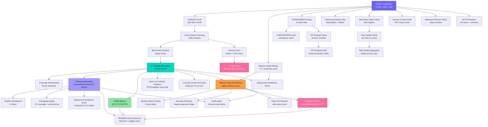

# MyHub Pipeline — Architecture

> Auto-generated 2026-06-20 19:46 UTC

## Block Dependency Graph

## Pipeline Stages

| Stage | Block | Key Outputs |
|-------|-------|-------------|
| Auth & Config | GitHub Integration | `GITHUB_TOKEN`, retry helpers, `push_file` |
| Repo Setup | Scaffold & Push | Repo files, CI workflow, branch protection |
| Quality | Code Quality & Security | `quality_report` DataFrame |
| Security | Security Scan + AI Auto-Fix | `security_scan_report`, PRs auto-opened |
| Benchmark | Benchmark Harness | `benchmark_df` stage timings |
| CI | CI / Testing Automation | `test_results`, 9/9 pass |
| Release | Release Automation | `new_version`, `changelog_md` |
| DORA | DORA Metrics | DF LT CFR MTTR with band ratings |
| Velocity | Sprint & Velocity Analytics | `sprint_df`, weekly throughput |
| Cost | Cost & Carbon Estimator | `cost_report` dollar and CO2 |
| ML | Predictive Failure | RandomForest failure probability |
| Quality | Flaky Test Detector | `flaky_report`, auto-issues |
| Portfolio | MyHub Dashboard | 5-tab Dash app |

## Tech Stack

- **Runtime**: Python 3.11 · Zerve canvas
- **CI/CD**: GitHub Actions (4-job parallel: test · lint · security · build)
- **ML**: scikit-learn RandomForest · transformers (AI PR review + auto-fix)
- **Viz**: Plotly · Matplotlib · Dash
- **Repo management**: GitHub REST API v3 (all operations via HTTPS)
- **Security**: Bandit SAST · PAT scope audit · branch protection · CODEOWNERS
- **Observability**: pipeline_history.json · Anomaly Detection (2σ) · DORA metrics

## Current Health Snapshot

| Metric | Value |
|--------|-------|
| Health | 100% |
| Version | v1.2.0 |
| Deploy Frequency | 0.23/wk  🔴 Low |
| Lead Time | 0.0h  ⚡ Elite |
| Change Failure Rate | 12.0%  🟡 Medium |
| MTTR | 0.0h  ⚡ Elite |
| Predicted Failure Risk | 0.0%  ✅ VERY LOW RISK |

*Updated: 2026-06-20 19:46 UTC*
