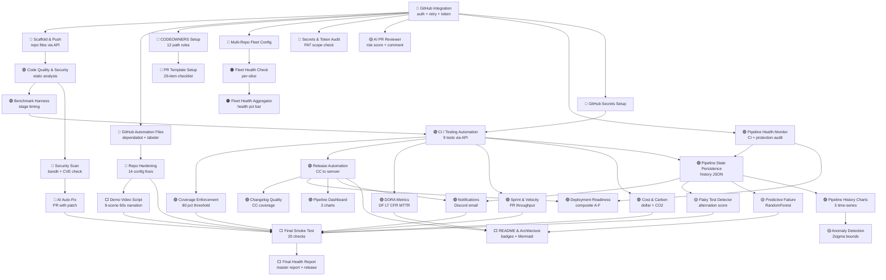

# MyHub Pipeline — Architecture
> v1.2.0 · Auto-generated 2026-06-20 20:22 UTC

---

## Full Pipeline Diagram



---

## Data Flow (Left → Right)

```
Auth & Config
  └─► Repo Setup (scaffold, automation, CODEOWNERS, protection)
        └─► Quality Gates (static analysis, security scan, benchmark)
              └─► CI / Testing (9 tests, coverage enforcement)
                    └─► Release Management (semver, CHANGELOG, GitHub Release)
                          └─► Observability (DORA, history, anomaly, predictions)
                                └─► Portfolio (README, demo script, smoke test, final report)
```

---

## What Runs When

| Block | Trigger |
|-------|---------|
| GitHub Integration | Manual / Run All |
| Scaffold & Push | Downstream of GitHub Integration |
| GitHub Automation Files | Downstream of GitHub Integration |
| CODEOWNERS Setup | Downstream of GitHub Integration |
| Repo Hardening & Config Fixes | Downstream of GitHub Automation Files |
| Pipeline Health Monitor | Downstream of GitHub Integration |
| Code Quality & Security | Downstream of Scaffold & Push |
| Security Scan | Downstream of Code Quality |
| AI Auto-Fix | Downstream of Security Scan (fires only on HIGH/MEDIUM findings) |
| Benchmark Harness | Downstream of Code Quality |
| CI / Testing Automation | Downstream of Benchmark Harness |
| Release Automation | Downstream of CI / Testing |
| DORA Metrics | Downstream of CI / Testing |
| Sprint & Velocity | Downstream of CI / Testing |
| Cost & Carbon | Downstream of CI / Testing |
| Coverage Enforcement | Downstream of CI / Testing |
| Pipeline State Persistence | Downstream of Health Monitor + CI |
| Pipeline History Charts | Downstream of State Persistence |
| Anomaly Detection | Downstream of History Charts (≥3 runs) |
| Flaky Test Detector | Downstream of State Persistence |
| Predictive Failure | Downstream of State Persistence |
| Notifications | On CI failure / health degraded / new release |
| Deployment Readiness Score | Downstream of Health Monitor + Release |
| README & Architecture | Downstream of DORA + Release + Predictive Failure |
| Demo Video Script | Downstream of README & Architecture |
| Final Smoke Test | Downstream of all terminal blocks |
| Final Health Report | Downstream of Smoke Test |
| Fleet Health Check | Per-repo slice (spread) |
| Fleet Health Aggregator | Aggregator for fleet slices |
| CI Workflow (GitHub Actions) | On push/PR to main — 4 parallel jobs |
| Webhook Relay | On any GitHub event to main |

---

## Colour Key

| Colour | Category |
|--------|----------|
| 🔵 Blue | Infrastructure & Auth |
| 🟢 Green | CI/CD & Quality Gates |
| 🔴 Red | Security |
| 🟡 Yellow | AI & Intelligence |
| 🟣 Purple | Observability |
| 🟠 Orange | Fleet Monitoring |
| ⬜ White | Portfolio & Output |

---

*Auto-generated by MyHub Pipeline · 2026-06-20 20:22 UTC*
